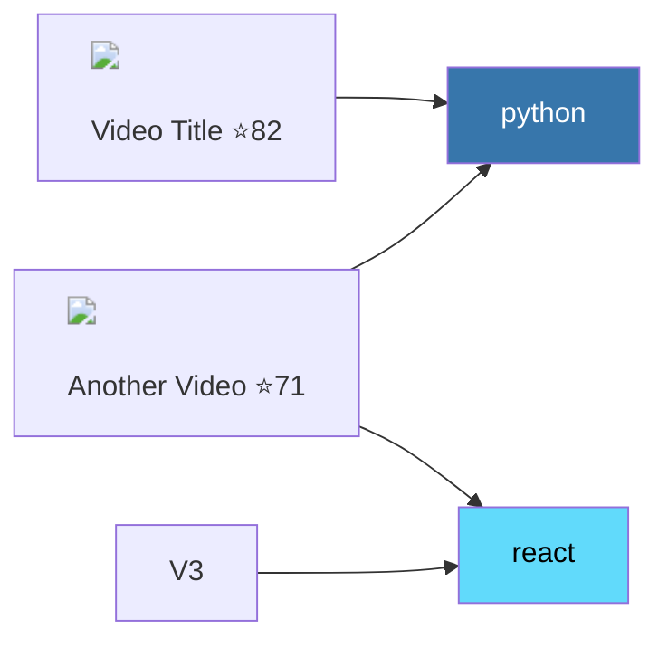

# YouTube Notification Cataloger — Design Spec

**Date:** 2026-03-16
**Status:** Draft
**Project:** ~/dev/youtube-cataloger/

## Purpose

A Python CLI tool that scrapes YouTube notification videos using Chrome browser automation (claude-in-chrome MCP), catalogs them with parallel Claude subagents, and outputs an Obsidian vault with categorized, ranked, and visualized video lists connected by topic tags.

The tool avoids marking notifications as read on YouTube's side.

## Architecture Overview

```
┌─────────────┐     ┌──────────────┐     ┌───────────────┐     ┌──────────────────┐
│  Scraper     │ →   │  Enricher    │ →   │  Categorizer  │ →   │  Vault Generator │
│  (chrome)    │     │  (parallel)  │     │  (Claude AI)  │     │  (Python)        │
└─────────────┘     └──────────────┘     └───────────────┘     └──────────────────┘
```

All phases are orchestrated by `cataloger.py`, which is the single entry point.

## Phase 1: Scraping (scraper.py)

### Approach

Uses `claude --print` with claude-in-chrome MCP tools to navigate YouTube and extract notification data.

### Steps

1. Spawn a Claude session via `subprocess` with `--allowedTools "mcp__claude-in-chrome__*"`
2. Claude navigates to `https://www.youtube.com/feed/notifications` (direct URL navigation — does NOT click the bell icon, preserving unread state)
3. Claude uses `get_page_text` or `read_page` to extract the visible notification entries
4. Claude scrolls down incrementally and re-reads after each scroll to capture newly loaded entries
5. For each notification entry, extract:
   - Video title
   - Channel name
   - Video URL (contains video ID)
   - Relative timestamp ("2 hours ago", "3 days ago")
   - Whether the URL contains `/shorts/` (pre-filter)
6. Scrolling continues until one of:
   - No new entries load after a scroll attempt
   - `--max-days N` threshold reached (based on relative timestamps)
   - `--max-videos N` count reached
7. Deduplicate by video ID
8. Filter out entries with `/shorts/` URLs
9. Save raw scraped data to `vault/runs/YYYY-MM-DD/data.json` as a checkpoint

### Checkpoint Format (data.json)

```json
{
  "scrape_date": "2026-03-16T14:30:00Z",
  "total_scraped": 142,
  "shorts_filtered": 23,
  "videos": [
    {
      "video_id": "dQw4w9WgXcQ",
      "title": "Video Title Here",
      "channel": "Channel Name",
      "url": "https://www.youtube.com/watch?v=dQw4w9WgXcQ",
      "relative_time": "3 days ago",
      "scraped_at": "2026-03-16T14:30:00Z"
    }
  ]
}
```

### Error Handling

- If Chrome is not available or not logged into YouTube, fail fast with a clear error message
- If scrolling stalls (same content after 3 scroll attempts), stop and proceed with what we have
- Checkpoint is written after scraping completes (even if partial), enabling `--from-checkpoint` re-runs

## Phase 2: Enrichment (enricher.py)

### Approach

Parallel Claude subagents visit individual video pages to extract detailed metadata not available from the notification feed.

### Steps

1. Take the list of scraped video entries from Phase 1
2. Batch videos into groups of ~5
3. For each batch, spawn a Claude subagent via `subprocess` with chrome MCP tools
4. Each subagent visits the video's YouTube page and extracts:
   - **Duration** (exact, from the video player or page metadata)
   - **Full description** (first 500 chars)
   - **View count**
   - **Like count** (if visible)
   - **Upload date** (exact date from the page)
   - **Thumbnail URL** (from the page's meta tags or video player)
   - **Is Short** (duration < 60 seconds — secondary filter)
5. Run batches in parallel using `concurrent.futures.ThreadPoolExecutor(max_workers=3)` (3 concurrent browser tabs)
6. Merge enriched data back into the video list
7. Filter out any newly-detected Shorts (duration < 60s)
8. Download thumbnails to `vault/runs/YYYY-MM-DD/thumbnails/<video-id>.jpg`
9. Update `data.json` checkpoint with enriched data

### Subagent Prompt Template

```
Visit this YouTube video page: {url}

Extract the following information and return it as JSON:
- duration_seconds: integer (total seconds)
- description: string (first 500 characters)
- view_count: integer
- like_count: integer or null
- upload_date: string (ISO 8601)
- thumbnail_url: string (highest resolution available)
- is_short: boolean (true if duration < 60 seconds)

Use the page metadata, video player, or page text to find this information.
Return ONLY the JSON object, no other text.
```

### Parallelism

- Max 3 concurrent browser tabs to avoid overwhelming Chrome
- Each batch of ~5 videos is processed sequentially within a subagent (one tab, visiting pages one after another)
- Total concurrent video page visits = 3 × 1 = 3 at a time

## Phase 3: Categorization & Ranking (categorizer.py)

### Approach

A single Claude call processes the entire video list for categorization and interest ranking. This is more efficient and produces more consistent results than per-video calls.

### Categories

**Main content tier** (standard interest scoring):
- **Programming** — coding tutorials, software engineering, DevOps, AI/ML, open source
- **Tech News** — product reviews, industry news, gadget launches
- **Comedy** — comedy sketches, funny videos, comedic commentary
- **Games** — game reviews, gameplay, esports, game development
- **Hardware/Electronics** — soldering, chip design, PCB, Arduino, electronics repair
- **DIY/Makers** — crafting, building, home projects, maker content (Evan and Katelyn style)
- **General** — anything that doesn't fit the above categories

**Sleep content tier** (separate scoring, separate list):
- **ASMR** — ASMR videos, whispered content
- **Chiropractic** — chiropractic adjustments, spine cracking
- **Massage** — massage therapy, relaxation massage

Sleep content is scored independently on its own 0-100 scale and output to a separate file. It does NOT appear in the main content lists.

### Interest Ranking (0-100) — Main Content

Base weights by category:
| Category | Base Score |
|---|---|
| Programming | 70 |
| Tech News | 70 |
| Comedy | 70 |
| DIY/Makers | 60 |
| Hardware/Electronics | 55 |
| Games | 45 |
| General | 30 |

Modifiers:
| Modifier | Points | Condition |
|---|---|---|
| Portuguese language | +15 | Video title/channel is in Portuguese |
| Favorite channel | +20 | Known favorites: Evan and Katelyn, MrWhoseTheBoss, Bernardo Almeida |
| Recency | +5 | Uploaded < 24 hours ago |
| Claude judgment | ±15 | Title appeal, description quality, relevance to user profile |

Score is clamped to 0-100.

### Interest Ranking (0-100) — Sleep Content

Scored on a separate scale:
- **Channel reputation for relaxation** (known ASMR/chiro channels score higher)
- **Video length** (longer = better for sleep, >30min gets a boost)
- **Title signals** (keywords like "sleep", "relaxing", "no talking")
- **Claude judgment** on relaxation quality

### Duration Sub-Groups

Within each category, videos are sub-grouped:
| Sub-Group | Duration Range |
|---|---|
| Super Small | < 5 minutes |
| Small | 5–10 minutes |
| Long | 10–50 minutes |
| Super Big | > 50 minutes |

### Sorting

Within each duration sub-group: **oldest first** (by upload date).

### Categorizer Prompt Template

```
You are categorizing YouTube videos for a user with these interests:
- Top interests: Programming, Tech News, Comedy
- Portuguese content gets a significant boost
- Favorites: Evan and Katelyn, MrWhoseTheBoss, Bernardo Almeida
- ASMR/chiropractic/massage = sleep content (separate tier)

For each video, provide:
1. category: one of [programming, tech-news, comedy, games, hardware, diy-makers, general, sleep]
2. interest_score: 0-100 (use the scoring rubric provided)
3. tags: 3-5 topic tags for graph view connections (e.g., "python", "react", "nvidia", "woodworking")
4. brief_summary: 1-2 sentence description

Videos list:
{json_video_list}

Return as JSON array.
```

## Phase 4: Vault Generation (vault_generator.py)

### Output Structure

```
vault/
├── runs/
│   └── 2026-03-16/
│       ├── index.md              # Main dashboard with mermaid graph
│       ├── by-category/
│       │   ├── programming.md
│       │   ├── tech-news.md
│       │   ├── comedy.md
│       │   ├── games.md
│       │   ├── hardware.md
│       │   ├── diy-makers.md
│       │   ├── general.md
│       │   └── sleep.md
│       ├── thumbnails/
│       │   └── <video-id>.jpg
│       └── data.json
├── templates/
│   └── video-card.md
└── graph-tags.md
```

### index.md — Main Dashboard

Contains:
1. **Run metadata**: Date, total videos, per-category counts
2. **Mermaid graph**: Tag-based connections between videos with HTML thumbnail attempts
3. **Gallery sections**: Per-category thumbnail grids with scores

#### Mermaid Graph Format

Attempts HTML image tags in nodes (with fallback to text-only if Obsidian strips them):



Tags are rendered as colored nodes. Videos sharing a tag are connected through it, enabling discovery of related content across categories.

The `--no-mermaid-thumbnails` CLI flag switches to text-only nodes if the HTML approach doesn't render.

#### Gallery Sections

Below the mermaid graph, each category gets a visual gallery:
```markdown
## 🎮 Programming (12 videos)
| | Title | Score | Duration | Channel |
|---|---|---|---|---|
| ![[thumbnails/abc.jpg\|80]] | [Video Title](url) | ⭐85 | 12:34 | Channel |
```

### Category Files (by-category/*.md)

Each category file contains the full video listings organized by duration sub-group:

```markdown
---
tags: [youtube-catalog, programming, 2026-03-16]
---
# Programming Videos

## Super Small (<5 min)

### [Video Title](https://youtube.com/watch?v=abc) — ⭐ 85/100
![[thumbnails/abc123.jpg|200]]
**Channel:** Channel Name | **Duration:** 4:32 | **Uploaded:** 2026-03-14
**Tags:** #python #tutorial #beginner
> Brief AI-generated summary of the video content

---

## Small (5-10 min)
...

## Long (10-50 min)
...

## Super Big (>50 min)
...
```

### graph-tags.md — Tag Ontology

Defines the tag taxonomy for consistency across runs:
```markdown
# Video Tag Taxonomy

## Programming Languages
- #python, #javascript, #typescript, #rust, #go

## Frameworks
- #react, #nextjs, #django, #flask

## Hardware
- #arduino, #raspberry-pi, #esp32, #soldering

## Topics
- #ai, #machine-learning, #devops, #web-dev
```

This file is maintained across runs (not overwritten) and grows as new tags are discovered.

### Thumbnail Handling

- Thumbnails are downloaded via Python's `urllib` from the URLs extracted during enrichment
- Saved as `thumbnails/<video-id>.jpg` in the run folder
- Embedded in markdown via Obsidian's wikilink syntax: `![[thumbnails/id.jpg|200]]`
- If download fails, a placeholder text is used instead

## Data Model (models.py)

```python
@dataclass
class Video:
    video_id: str
    title: str
    channel: str
    url: str
    relative_time: str          # From scraping
    duration_seconds: int | None  # From enrichment
    description: str | None
    view_count: int | None
    like_count: int | None
    upload_date: str | None     # ISO 8601
    thumbnail_url: str | None
    thumbnail_path: str | None  # Local path after download
    is_short: bool
    category: str | None        # From categorization
    interest_score: int | None  # 0-100
    tags: list[str]             # For graph connections
    summary: str | None         # AI-generated brief
    duration_group: str | None  # super-small, small, long, super-big

@dataclass
class CatalogRun:
    run_date: str
    total_scraped: int
    shorts_filtered: int
    videos: list[Video]
    categories: dict[str, list[Video]]  # Grouped
```

## CLI Interface (cataloger.py)

```
usage: cataloger.py [-h] [--max-days N] [--max-videos N]
                    [--from-checkpoint PATH] [--no-mermaid-thumbnails]
                    [--workers N]

YouTube Notification Cataloger

options:
  --max-days N           Only scrape notifications from the last N days
  --max-videos N         Stop after scraping N videos
  --from-checkpoint PATH Skip scraping, load from a previous data.json
  --no-mermaid-thumbnails Use text-only mermaid nodes (no HTML img attempts)
  --workers N            Number of parallel enrichment workers (default: 3)
```

### Execution Flow

```python
def main():
    args = parse_args()
    run_date = date.today().isoformat()
    run_dir = f"vault/runs/{run_date}"

    # Phase 1: Scrape (or load checkpoint)
    if args.from_checkpoint:
        videos = load_checkpoint(args.from_checkpoint)
    else:
        videos = scrape_notifications(
            max_days=args.max_days,
            max_videos=args.max_videos
        )
        save_checkpoint(videos, run_dir)

    # Phase 2: Enrich (parallel subagents)
    videos = enrich_videos(videos, workers=args.workers)
    videos = [v for v in videos if not v.is_short]  # Final short filter
    download_thumbnails(videos, run_dir)
    save_checkpoint(videos, run_dir)  # Update checkpoint

    # Phase 3: Categorize & Rank (single Claude call)
    videos = categorize_and_rank(videos)
    save_checkpoint(videos, run_dir)  # Final checkpoint

    # Phase 4: Generate Obsidian vault
    generate_vault(videos, run_dir,
                   mermaid_thumbnails=not args.no_mermaid_thumbnails)
```

## Dependencies

- Python 3.12+ (stdlib only for core logic)
- `claude` CLI (for spawning subagents)
- Claude-in-Chrome MCP (for browser automation)
- Chrome browser (logged into YouTube)

No pip packages required — the script uses only stdlib (`subprocess`, `json`, `dataclasses`, `concurrent.futures`, `argparse`, `urllib`, `pathlib`, `datetime`).

## Non-Goals

- No YouTube Data API integration (keeping it API-key-free)
- No scheduled/automated runs (manual CLI invocation only)
- No web UI for the output (Obsidian is the viewer)
- No modification of YouTube notification state (read-only)
- No caching of video metadata across runs (each run is independent)

## Risks & Mitigations

| Risk | Mitigation |
|---|---|
| YouTube DOM changes break scraping | Claude's natural language understanding of page content is resilient to minor DOM changes; checkpoint system allows re-processing |
| Chrome not logged in | Fail fast with clear error message directing user to log in |
| Too many notifications (slow) | `--max-days` and `--max-videos` flags; checkpoint system for incremental work |
| Mermaid HTML images don't render | `--no-mermaid-thumbnails` flag; gallery sections always work |
| Rate limiting on Claude CLI calls | 3-worker limit by default; configurable via `--workers` |
